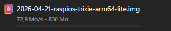

# Required material

- MicroSD card
- MicroSD to USB adapter
- Bluetooth USB adapter
- Raspberry pi 4/5
- Power Supply for raspberry pi (USB-C)
- Raspberry pi casing

# Download LRIMa central image
> [!CAUTION]
> THIS PROGRAM ONLY WORKS ON CHROMIUM BROWSERS

From within a greenhouse, select connected devices.

click on it.

There should be a "download Image" button at the top of the screen.

Upon press, the following page will open. 

Fill the form with the required information. 
## Object ID:
Can be obtained by copying the gray text besides the name of the central

## Auth token
Can be obtained by clicking the "copy Auth token" in the website

> [!NOTE]
> This has not been tested with 5Ghz wifi. For the sake of stability, please stay on 2.4Ghz wifi.

## WIFI SSID
Enter your wifi name

## WIFI Password
Enter your wifi password

then, press the `Download` button.

> [!WARNING]
> Please ensure the file is downloaded in one shot. If there is any interruption, assume the file is corrupted.

the download will then start!

# Flashing the Image file
First, download and install balena etcher. 

https://etcher.balena.io/

Then, open it.

first, select `flash from file`

If the MicroSD card reader has not been already inserted, insert it now. 

you will see it in the second column

if not selected automatically, press change and select your drive.

finally, press flash

then, wait until balena etcher shows that it finished the flash.

Take the MicroSD card, then put it in the raspberry pi. 

then the bluetooth adaptator

then power on the raspberry pi!

wait for around 15 minutes...

And it should be good!
